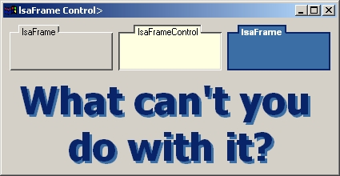

<div align="center">

## lsaFrame Control


</div>

### Description

This code is an example of how to make a frame control.
 
### More Info
 


<span>             |<span>
---                |---
**Submitted On**   |2002-05-28 21:04:44
**By**             |[Rowan Lewis](https://github.com/Planet-Source-Code/PSCIndex/blob/master/ByAuthor/rowan-lewis.md)
**Level**          |Beginner
**User Rating**    |5.0 (15 globes from 3 users)
**Compatibility**  |VB 4\.0 \(16\-bit\), VB 4\.0 \(32\-bit\), VB 5\.0, VB 6\.0
**Category**       |[Custom Controls/ Forms/  Menus](https://github.com/Planet-Source-Code/PSCIndex/blob/master/ByCategory/custom-controls-forms-menus__1-4.md)
**World**          |[Visual Basic](https://github.com/Planet-Source-Code/PSCIndex/blob/master/ByWorld/visual-basic.md)
**Archive File**   |[lsaFrame\_C873325272002\.zip](https://github.com/Planet-Source-Code/rowan-lewis-lsaframe-control__1-35139/archive/master.zip)

### API Declarations

```
'There are no Windows API/Global Declarations
'Coool.
```


